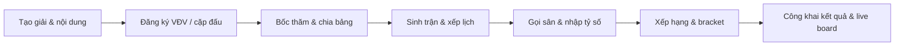

# Tournament Manager

Tournament Manager là nền tảng quản lý và vận hành giải đấu dành cho
**Badminton** và **Pickleball**. Hệ thống hỗ trợ toàn bộ quy trình từ chuẩn bị
giải, tiếp nhận vận động viên, bốc thăm, xếp lịch và nhập tỷ số cho đến công bố
kết quả trực tiếp cho khán giả.

Giao diện được tối ưu cho cả máy tính và điện thoại, có tiếng Việt và English,
phù hợp với ban tổ chức, điều hành viên, trọng tài sân và người theo dõi giải.

## Luồng vận hành

## Chức năng chính

### Chuẩn bị giải đấu

- Quản lý giải đấu theo môn thể thao, múi giờ, địa điểm và thời gian tổ chức.
- Tạo nội dung đơn/đôi, cấu hình vòng bảng và vòng loại trực tiếp.
- Thiết lập luật thi đấu theo từng giai đoạn, bao gồm số set, điểm thắng,
  cách biệt và điểm tối đa.
- Quản lý sân, mã sân, trạng thái hoạt động và PIN truy cập cho trọng tài.

### Vận động viên và đăng ký

- Quản lý câu lạc bộ, vận động viên và hồ sơ xếp hạng riêng theo từng môn.
- Tạo VĐV/cặp đấu, hạt giống và trạng thái tham dự.
- Import danh sách từ Excel, kiểm tra dữ liệu trước khi ghi và export dữ liệu
  giải để lưu trữ.
- Dữ liệu giải đấu, CLB và VĐV được phân tách theo chủ sở hữu.

### Bốc thăm và sinh trận

- Bốc thăm chia bảng trực quan với hạt giống.
- Ưu tiên tách các VĐV/cặp cùng CLB khi vẫn còn vị trí hợp lệ.
- Sinh lịch vòng tròn theo bảng và bracket loại trực tiếp.
- Hỗ trợ chung kết, tranh hạng ba, walkover, no-show, retirement,
  disqualification và cancellation.

### Xếp lịch và điều hành sân

- Gán lịch thủ công hoặc tự động theo nhiều sân.
- Cấu hình thời lượng trận, thời gian nghỉ và tránh một cặp thi đấu hai lượt
  liên tiếp.
- Kiểm tra xung đột sân/VĐV, khóa lịch và xem trước bản in.
- Bảng điều hành sân hiển thị trận đang đấu và trận tiếp theo.

### Nhập tỷ số và kết quả

- Nhập tỷ số trực tiếp bằng giao diện cảm ứng tối ưu cho điện thoại.
- Mở trang trọng tài sân bằng QR/link và PIN mà không cần tài khoản admin.
- Tự động tính kết quả trận, bảng xếp hạng, đội đi tiếp và sơ đồ giải.
- Hiển thị nổi bật trận chung kết, hạng ba và đường đi trong bracket.

### Dashboard và kênh công khai

- Dashboard tổng hợp số lượng đăng ký, trận chờ, đang đấu, hoàn thành và sân.
- TV board cho khu vực vận hành và bảng live công khai cho khán giả.
- Live board ưu tiên cập nhật bằng Server-Sent Events (SSE), tự chuyển sang
  polling khi kết nối stream không khả dụng.
- Trang giải công khai hiển thị lịch, kết quả, bảng đấu, xếp hạng và bracket mà
  không làm lộ dữ liệu cá nhân.

### Quản trị và phân quyền

| Vai trò | Phạm vi chính |
|---|---|
| `SUPER_ADMIN` | Quản lý toàn hệ thống, tài khoản và mọi giải đấu |
| `ADMIN` | Quản trị giải đấu được sở hữu hoặc được phân quyền |
| `OPERATOR` | Điều hành đăng ký, bốc thăm, lịch, sân và trận đấu |
| `SCOREKEEPER` | Gọi sân và cập nhật tỷ số theo quyền được cấp |
| `VIEWER` | Xem dữ liệu vận hành trong phạm vi được chia sẻ |
| Court PIN | Truy cập trang nhập tỷ số của một sân, không cần tài khoản |

Chủ giải có thể mời tài khoản hiện có vào từng giải và gán vai trò riêng mà
không mở quyền truy cập sang dữ liệu của chủ sở hữu khác.

## Tài liệu

- [Hướng dẫn sử dụng trực tuyến](https://vthang87.github.io/Tournament-Manager/)
- [Hướng dẫn sử dụng trong repository](docs/hdsd/index.md)
- [Tài liệu dành cho developer](DEVELOPMENT.md)
- [Kiến trúc hệ thống](docs/architecture.md)
- [Triển khai bằng Portainer](docs/portainer-deploy.md)
- [Chiến lược open source](docs/open-source-strategy.md)
