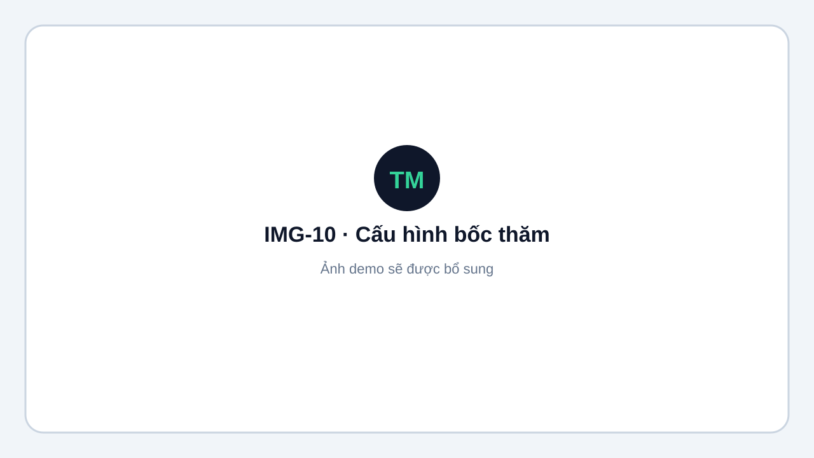
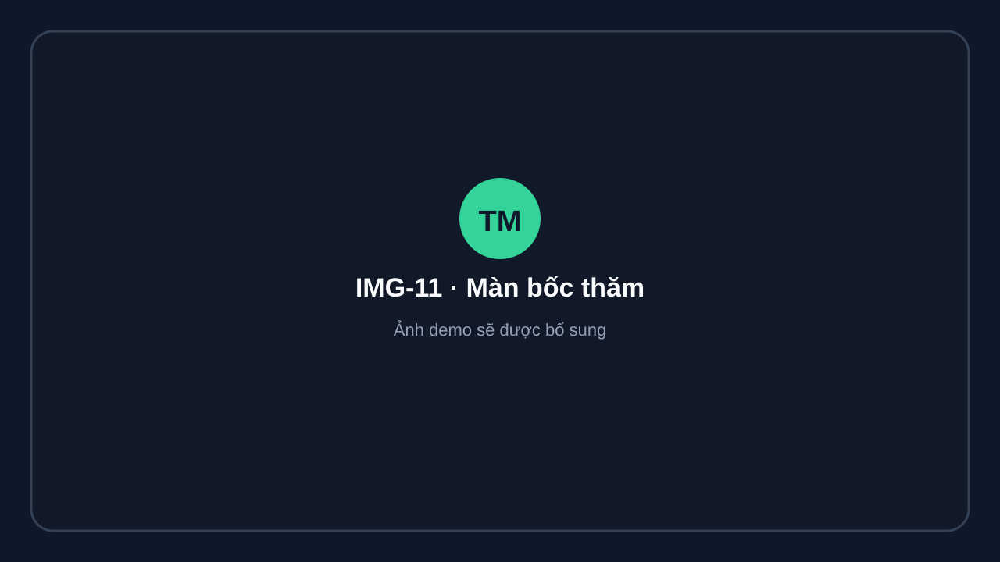
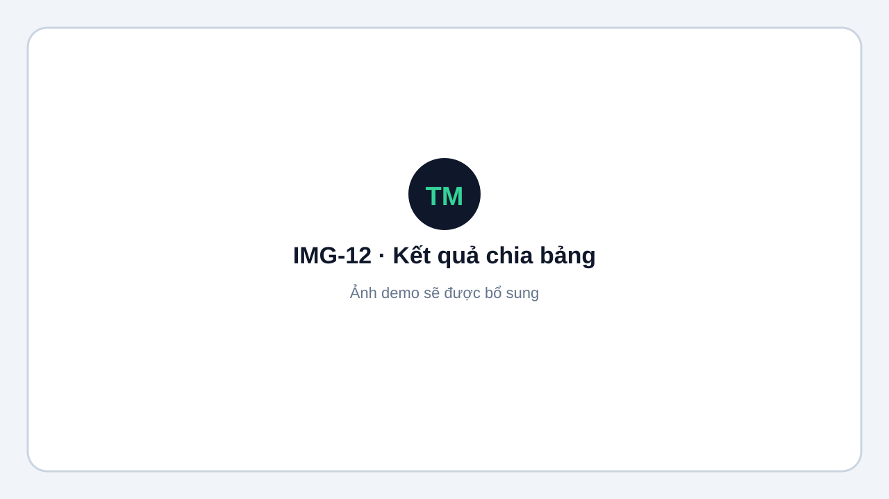

# Bốc thăm

Trước khi bốc thăm, nội dung cần đủ đăng ký hợp lệ và ở trạng thái sẵn sàng.

## Thực hiện

1. Mở **Nội dung → Bốc thăm**.
2. Kiểm tra số bảng, số đội và cấu hình hạt giống.
3. Bắt đầu phiên bốc thăm.
4. Kiểm tra kết quả phân bảng.
5. Xác nhận draw.
6. Sinh trận vòng bảng hoặc bracket tương ứng.

<figure markdown="span">
  
  <figcaption>IMG-10 · Cấu hình số bảng và hạt giống · Desktop · Ảnh demo sẽ được bổ sung.</figcaption>
</figure>

<figure markdown="span">
  
  <figcaption>IMG-11 · Màn bốc thăm trực quan · Desktop widescreen · Ảnh demo sẽ được bổ sung.</figcaption>
</figure>

<figure markdown="span">
  
  <figcaption>IMG-12 · Kết quả chia bảng đã xác nhận · Desktop · Ảnh demo sẽ được bổ sung.</figcaption>
</figure>

!!! warning
    Chỉ xác nhận khi kết quả đã đúng. Sau khi xác nhận, tiếp tục sinh trận và xếp lịch theo quy trình của giải.
