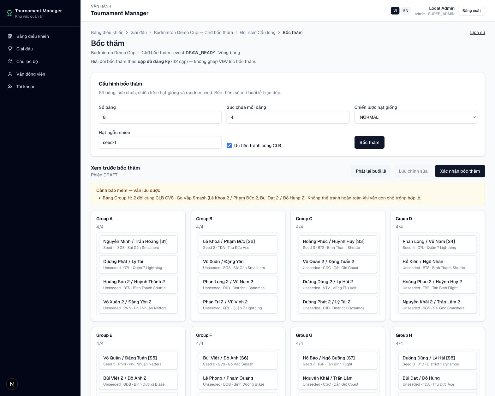
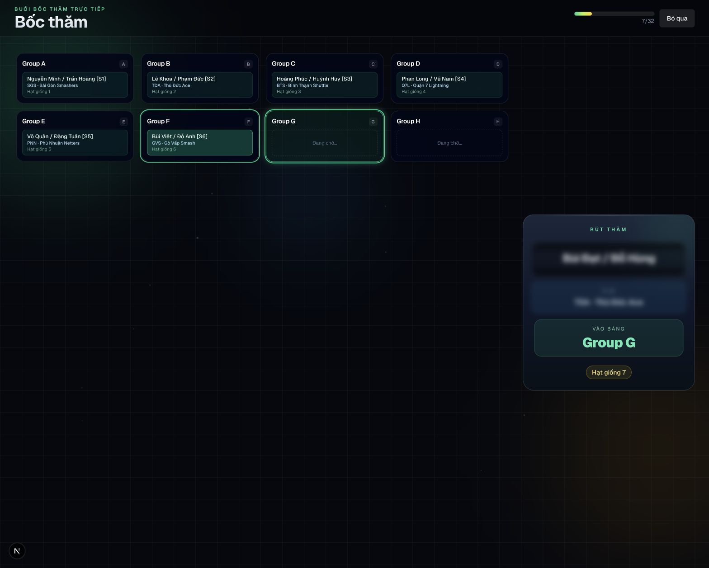
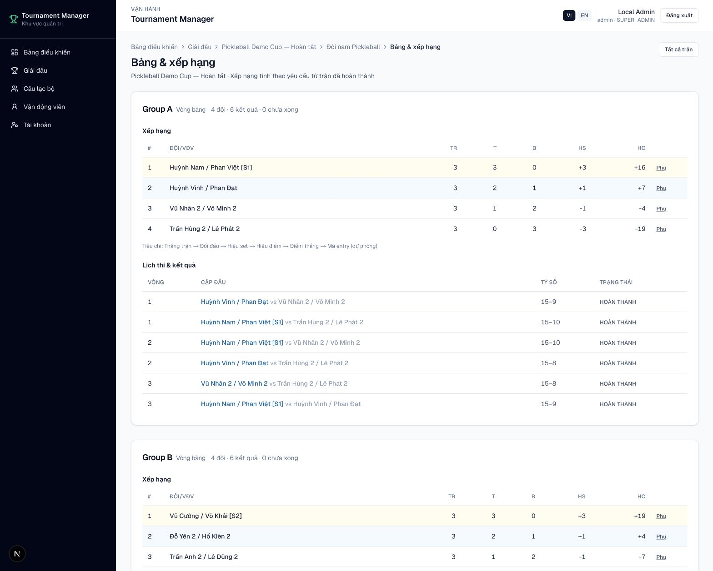

# Bốc thăm

Trước khi bốc thăm, nội dung cần đủ đăng ký hợp lệ và ở trạng thái sẵn sàng.

## Thực hiện

1. Mở **Nội dung → Bốc thăm**.
2. Kiểm tra số bảng, sức chứa, chiến lược hạt giống và random seed.
3. Bật **Ưu tiên tránh cùng CLB** nếu điều lệ yêu cầu.
4. Bắt đầu phiên bốc thăm.
5. Kiểm tra kết quả phân bảng và các cảnh báo mềm.
6. Xác nhận draw.
7. Sinh trận vòng bảng hoặc bracket tương ứng.

<figure markdown="span">
  
  <figcaption>IMG-10 · Cấu hình bảng, hạt giống và ràng buộc CLB · Desktop.</figcaption>
</figure>

<figure markdown="span">
  
  <figcaption>IMG-11 · Buổi lễ bốc thăm trực quan theo từng bảng · Desktop widescreen.</figcaption>
</figure>

<figure markdown="span">
  
  <figcaption>IMG-12 · Bảng đấu, xếp hạng và kết quả sau khi xác nhận · Desktop.</figcaption>
</figure>

!!! warning
    Chỉ xác nhận khi kết quả đã đúng. Sau khi xác nhận, tiếp tục sinh trận và xếp lịch theo quy trình của giải.

!!! info "Cảnh báo cùng CLB"
    Engine sẽ tối ưu để tách các cặp cùng CLB khi còn vị trí hợp lệ. Nếu không
    thể tránh hoàn toàn, hệ thống hiển thị rõ bảng và các cặp bị trùng để Ban
    tổ chức quyết định trước khi xác nhận.
