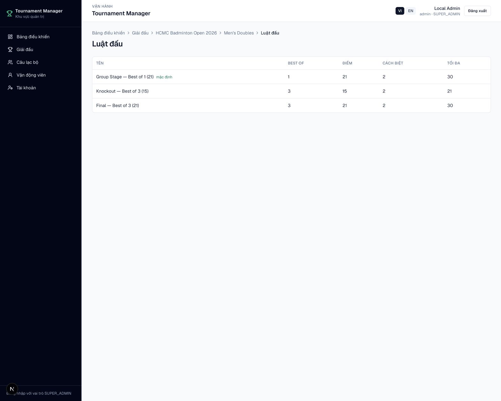
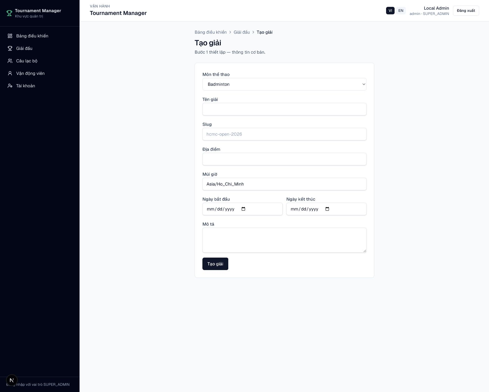
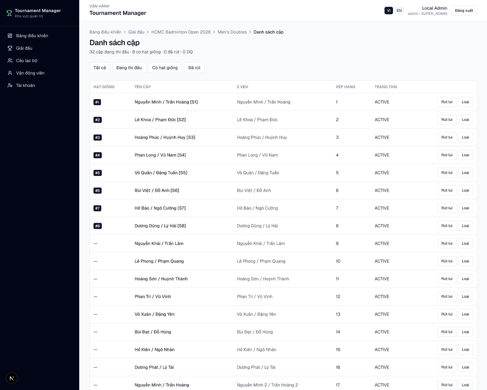
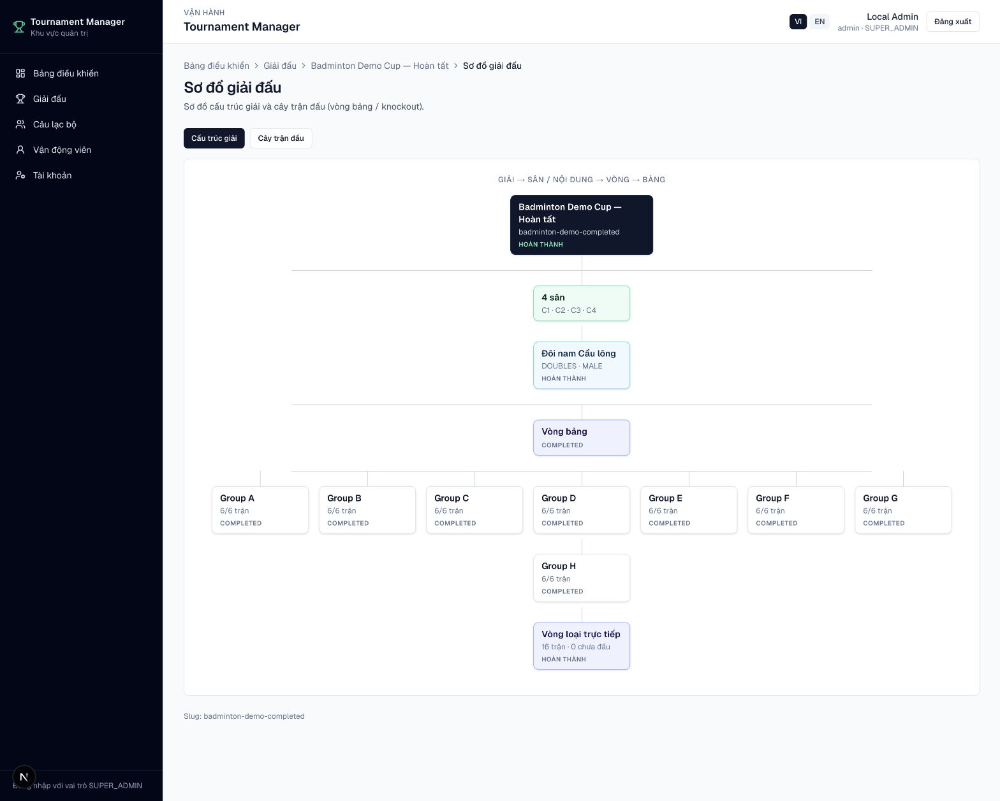

# Chuẩn bị giải

## Quy trình tổng quát

1. Đăng nhập Admin.
2. Tạo hoặc mở **Giải đấu**, chọn môn thể thao và preset phù hợp.
3. Thêm **Nội dung** thi đấu đơn hoặc đôi.
4. Cấu hình luật điểm và các vòng `GROUP` / `KNOCKOUT`.
5. Thêm CLB, VĐV và đăng ký thi đấu.
6. Bốc thăm, xác nhận kết quả và sinh trận.
7. Gán sân và lịch thi đấu.

<figure markdown="span">
  
  <figcaption>IMG-04 · Cấu hình luật điểm theo nội dung và vòng đấu · Desktop.</figcaption>
</figure>

## Môn thể thao và preset

Mỗi giải được gắn một môn thể thao để phân loại giải, CLB, VĐV và luật áp
dụng. Bản demo có sẵn Badminton và Pickleball. Khi tạo giải, chọn preset gần
nhất với nhu cầu rồi điều chỉnh luật ở từng nội dung hoặc từng vòng.

Các preset Badminton gồm:

- **BWF Standard**
- **Fast Tournament**
- **Company Tournament**
- **University Tournament**

<figure markdown="span">
  
  <figcaption>IMG-29 · Tạo giải, chọn môn thể thao và thông tin vận hành · Desktop.</figcaption>
</figure>

## CLB, vận động viên và đăng ký

Có thể nhập CLB và VĐV trước, sau đó tạo đăng ký trong từng nội dung. Với số lượng lớn, dùng [Import Excel](import-export.md).

<figure markdown="span">
  
  <figcaption>IMG-05 · Danh sách đăng ký, CLB và hạt giống của một nội dung · Desktop.</figcaption>
</figure>

## Sơ đồ giải

Vào **Admin → Giải → Sơ đồ giải đấu**:

- **Cấu trúc giải:** giải → sân / nội dung → vòng → bảng.
- **Cây trận đấu:** bracket loại trực tiếp và tiến độ vòng bảng.

<figure markdown="span">
  
  <figcaption>IMG-06 · Sơ đồ cấu trúc giải và cây trận đấu · Desktop.</figcaption>
</figure>
