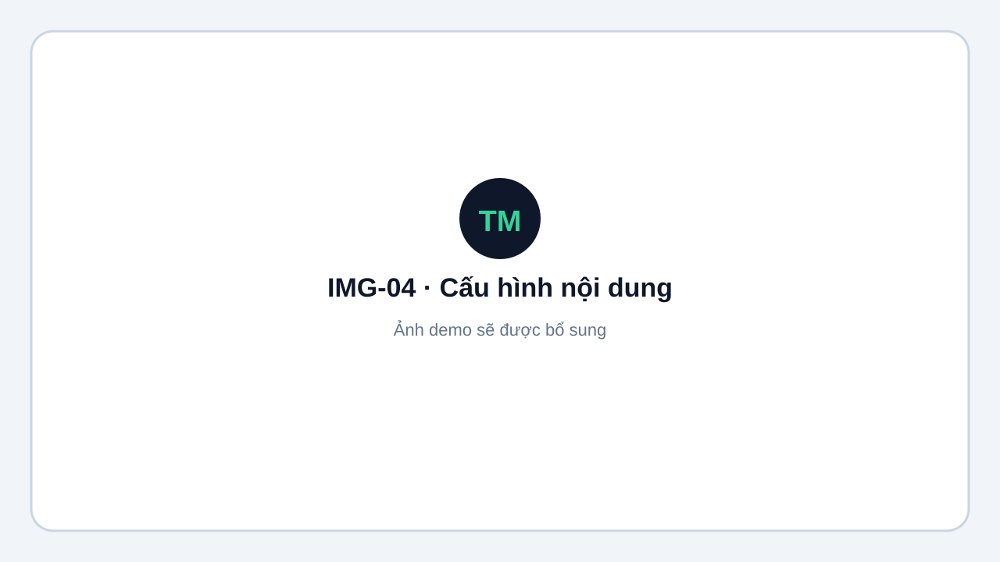
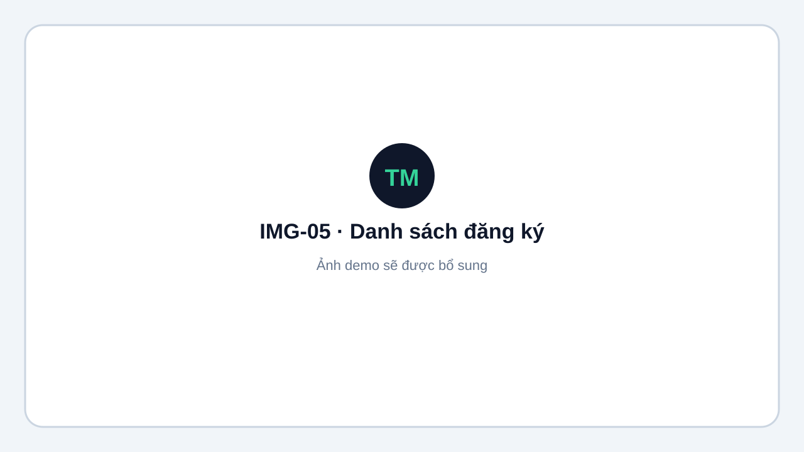
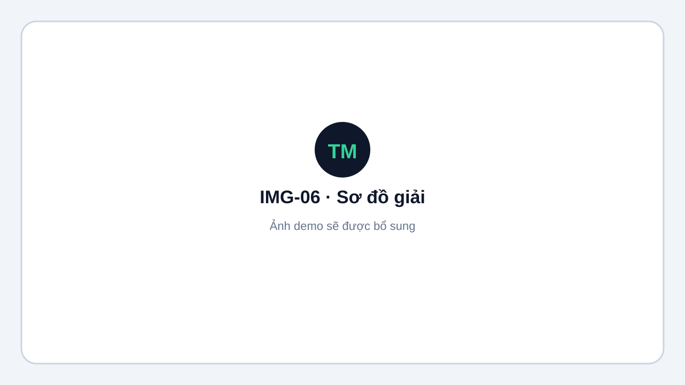

# Chuẩn bị giải

## Quy trình tổng quát

1. Đăng nhập Admin.
2. Tạo hoặc mở **Giải đấu**.
3. Thêm **Nội dung** thi đấu đơn hoặc đôi.
4. Cấu hình luật điểm và các vòng `GROUP` / `KNOCKOUT`.
5. Thêm CLB, VĐV và đăng ký thi đấu.
6. Bốc thăm, xác nhận kết quả và sinh trận.
7. Gán sân và lịch thi đấu.

<figure markdown="span">
  
  <figcaption>IMG-04 · Cấu hình nội dung, luật điểm và vòng đấu · Desktop · Ảnh demo sẽ được bổ sung.</figcaption>
</figure>

## CLB, vận động viên và đăng ký

Có thể nhập CLB và VĐV trước, sau đó tạo đăng ký trong từng nội dung. Với số lượng lớn, dùng [Import Excel](import-export.md).

<figure markdown="span">
  
  <figcaption>IMG-05 · Danh sách đăng ký của một nội dung · Desktop · Ảnh demo sẽ được bổ sung.</figcaption>
</figure>

## Sơ đồ giải

Vào **Admin → Giải → Org chart**:

- **Cấu trúc giải:** giải → sân / nội dung → vòng → bảng.
- **Cây trận đấu:** bracket loại trực tiếp và tiến độ vòng bảng.

<figure markdown="span">
  
  <figcaption>IMG-06 · Org chart và cây trận đấu · Desktop · Ảnh demo sẽ được bổ sung.</figcaption>
</figure>
