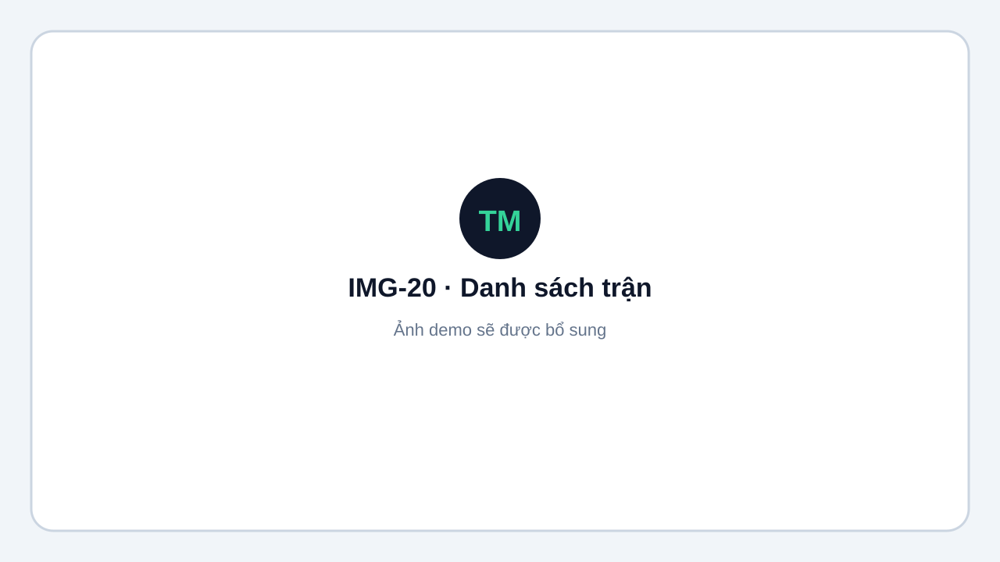
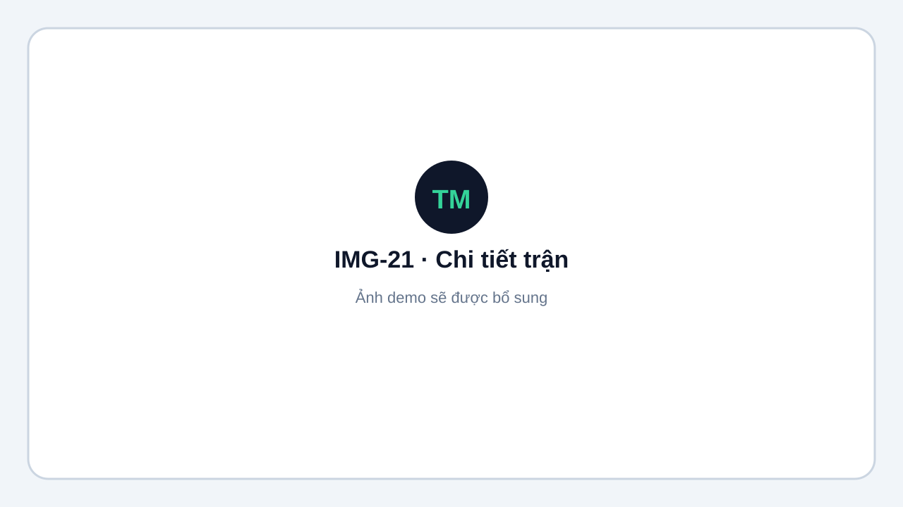
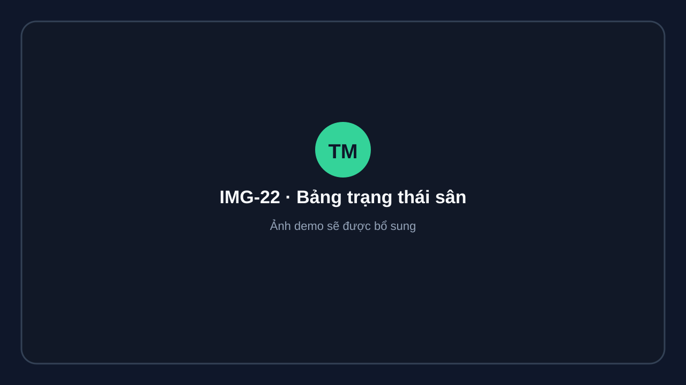

# Điều hành trận từ Admin

Vào **Nội dung → Trận đấu (Matches)**.

## Danh sách trận

- Lọc theo bảng, vòng hoặc trạng thái.
- Theo dõi thời gian bắt đầu và kết thúc theo timezone giải.
- Đội thắng hiển thị màu xanh, đội thua màu xám khi trận hoàn tất.

<figure markdown="span">
  
  <figcaption>IMG-20 · Danh sách và bộ lọc trận đấu · Desktop · Ảnh demo sẽ được bổ sung.</figcaption>
</figure>

## Chi tiết trận

Tại trang chi tiết, người có quyền có thể:

- Gán sân, gọi vào sân hoặc bắt đầu trận.
- Ghi điểm live.
- Sửa kết quả, hủy trận hoặc xử lý walkover theo quyền.

<figure markdown="span">
  
  <figcaption>IMG-21 · Chi tiết và các thao tác điều hành trận · Desktop · Ảnh demo sẽ được bổ sung.</figcaption>
</figure>

## Bảng sân dành cho vận hành

| Màn hình | URL | Ghi chú |
|---|---|---|
| Công khai | `/t/{slug}/live` | TV và khán giả, không cần đăng nhập |
| Admin | `/admin/tournaments/{id}/live` | Chuyển sang bảng public theo slug |
| Bảng sân | `/admin/tournaments/{id}/courts/live` | Trạng thái từng sân, trận hiện tại và tiếp theo |

Bảng live tự làm mới khoảng 12 giây và hiển thị đếm ngược gọi vào sân.

<figure markdown="span">
  
  <figcaption>IMG-22 · Bảng trạng thái các sân dành cho vận hành · Desktop widescreen · Ảnh demo sẽ được bổ sung.</figcaption>
</figure>
