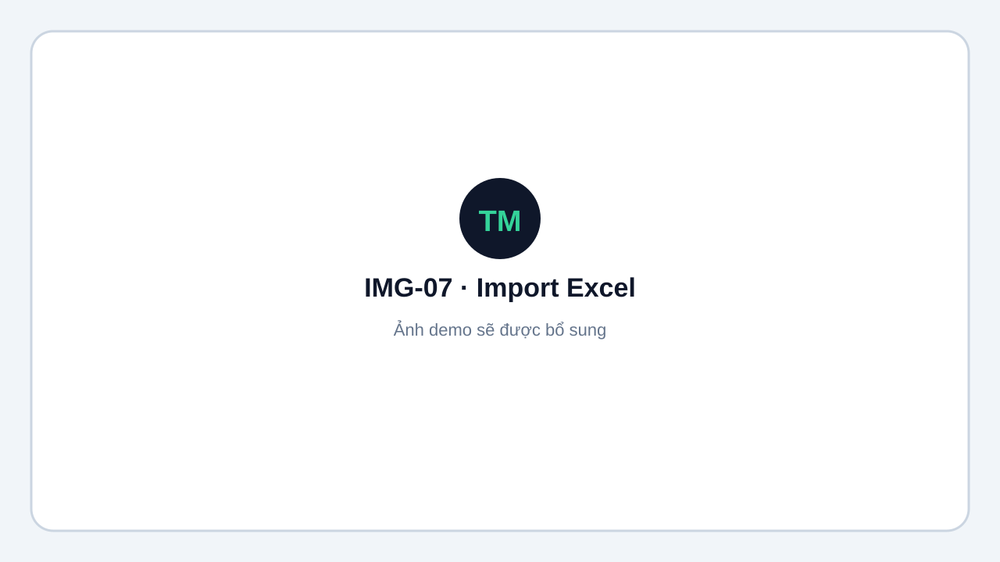
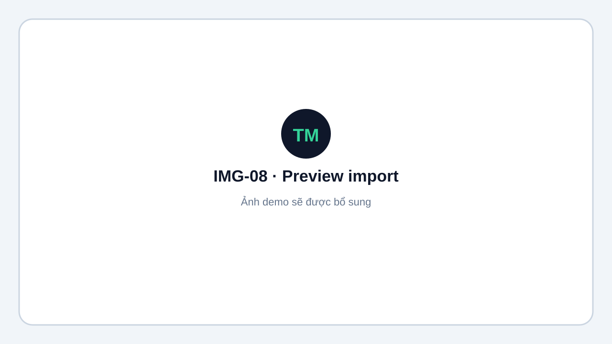
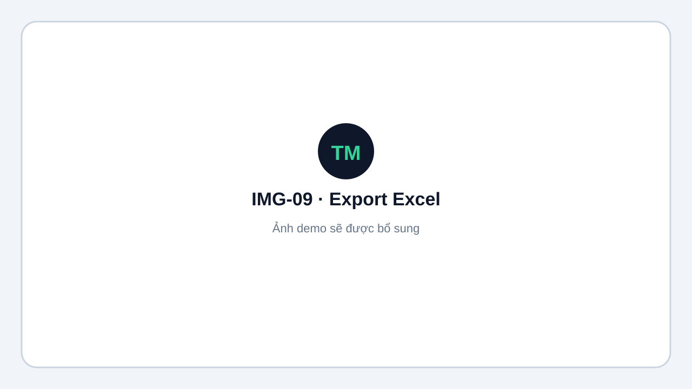

# Import và Export Excel

Vào **Nội dung → Import / Export**. Chức năng import dành cho `ADMIN` và `OPERATOR`.

## Import đăng ký

1. Tải template mẫu.
2. Điền dữ liệu theo loại nội dung:
   - **Đơn:** `Player Name`, `Club`, `Seed`
   - **Đôi:** `Player 1`, `Player 2`, `Club`, `Seed`
3. Upload file `.xlsx`.
4. Kiểm tra preview và sửa các lỗi chặn.
5. Chọn **Xác nhận import**.

<figure markdown="span">
  
  <figcaption>IMG-07 · Chọn template và upload file Excel · Desktop · Ảnh demo sẽ được bổ sung.</figcaption>
</figure>

<figure markdown="span">
  
  <figcaption>IMG-08 · Preview dữ liệu hợp lệ và lỗi cần sửa · Desktop · Ảnh demo sẽ được bổ sung.</figcaption>
</figure>

!!! info "Giới hạn"
    File tối đa **2 MiB** và **500 dòng**. Import chạy trong một transaction nên không ghi một phần khi có lỗi. Import chủ yếu tạo mới, không cập nhật bản ghi đã tồn tại.

## Export

Người dùng có quyền xem có thể xuất:

- `Participants`
- `GroupDraw`
- `Schedule`
- `Results`
- `Standings`

<figure markdown="span">
  
  <figcaption>IMG-09 · Các lựa chọn export của nội dung · Desktop · Ảnh demo sẽ được bổ sung.</figcaption>
</figure>
