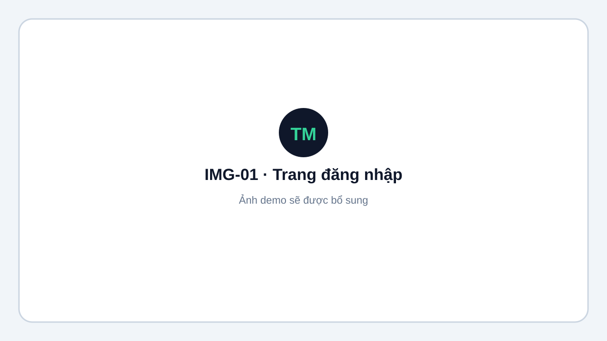
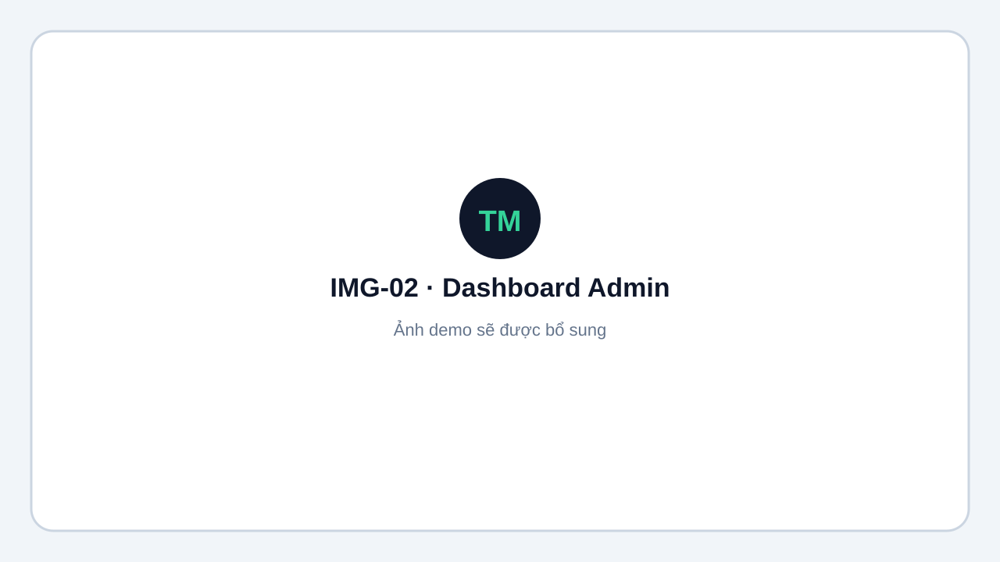
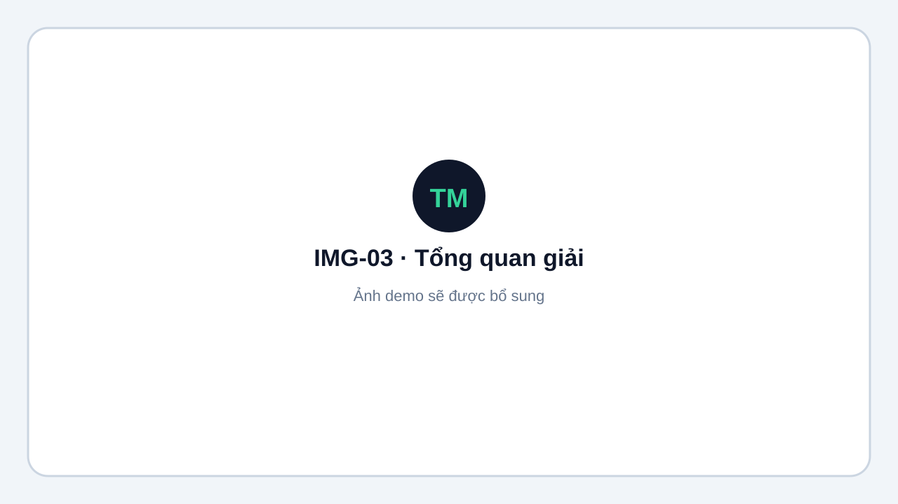

# Hướng dẫn sử dụng Tournament Manager

Tournament Manager hỗ trợ toàn bộ quy trình vận hành giải đấu: chuẩn bị dữ liệu, bốc thăm, xếp lịch, ghi tỉ số theo sân và công khai kết quả.

Tài liệu này dành cho:

- **Quản trị hệ thống** (`SUPER_ADMIN`): quản lý tài khoản và quyền truy cập
  nền tảng.
- **Ban tổ chức** (`ADMIN` / `OPERATOR`): thiết lập và điều hành giải.
- **Trọng tài theo sân**: mở link sân và nhập PIN, không cần tài khoản.
- **Khán giả**: xem lịch, kết quả, bảng xếp hạng và bảng live.

Giao diện hỗ trợ **Tiếng Việt** và **English**. Có thể đổi ngôn ngữ trên header Admin, trang đăng nhập hoặc trang giải công khai.

<figure markdown="span">
  
  <figcaption>IMG-01 · Trang đăng nhập · Desktop · Ảnh demo sẽ được bổ sung.</figcaption>
</figure>

## Khái niệm nhanh

| Vai trò | Cách vào hệ thống | Việc chính |
|---|---|---|
| **Super Admin** | `/login` → `/admin/users` | Tạo, phân quyền, khóa tài khoản và đặt lại mật khẩu |
| **Admin / Operator** | `/login` → `/admin` | Tạo giải, sân, nội dung, bốc thăm, lịch và giám sát |
| **Trọng tài theo sân** | `/r/{slug}/c/{mã-sân}` + PIN | Ghi tỉ số trên đúng sân được phân công |
| **Khán giả** | `/t/{slug}` hoặc `/t/{slug}/live` | Theo dõi giải ở chế độ chỉ đọc |

<figure markdown="span">
  
  <figcaption>IMG-02 · Dashboard quản trị sau đăng nhập · Desktop · Ảnh demo sẽ được bổ sung.</figcaption>
</figure>

<figure markdown="span">
  
  <figcaption>IMG-03 · Trang tổng quan một giải đấu · Desktop · Ảnh demo sẽ được bổ sung.</figcaption>
</figure>

## Luồng vận hành

1. Super Admin [tạo tài khoản và phân quyền](quan-ly-tai-khoan.md).
2. [Chuẩn bị giải](chuan-bi-giai.md): tạo nội dung, luật, vòng đấu và danh sách đăng ký.
3. [Import dữ liệu](import-export.md) hoặc nhập thủ công.
4. [Bốc thăm](boc-tham.md), sinh trận và xếp lịch.
5. [Thiết lập sân và PIN](san-va-pin.md).
6. [Điều hành ngày thi đấu](ngay-thi-dau.md).
7. Chia sẻ [trang công khai](khan-gia.md) cho khán giả.

!!! tip "Bắt đầu nhanh"
    Nếu chỉ cần chạy thử, xem [Môi trường demo](demo.md) để khởi động hệ thống và dùng dữ liệu mẫu.
