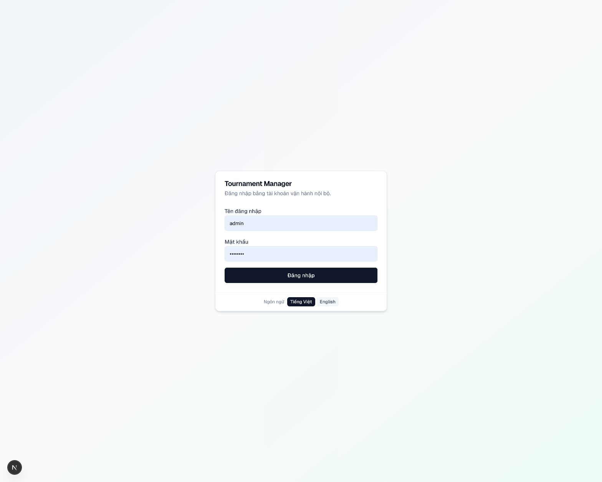
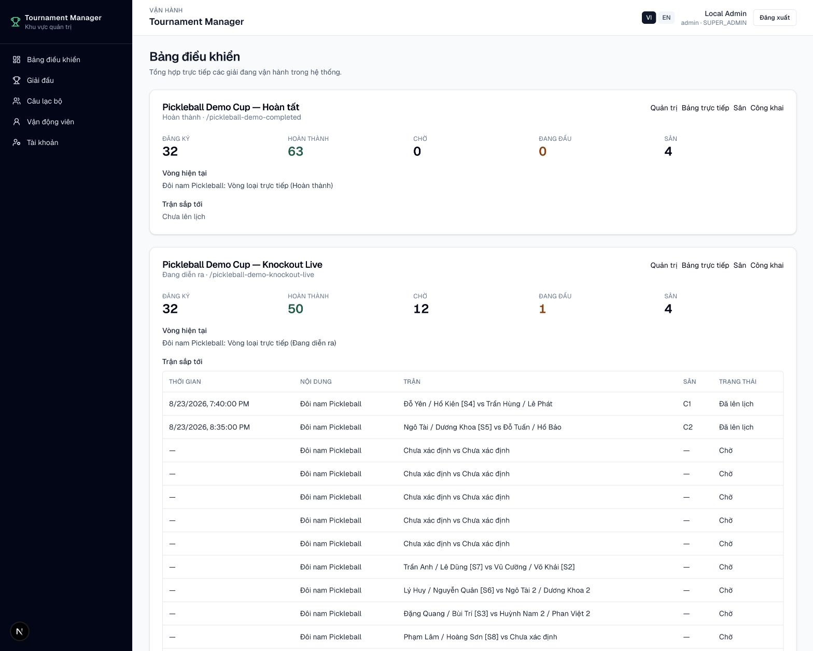
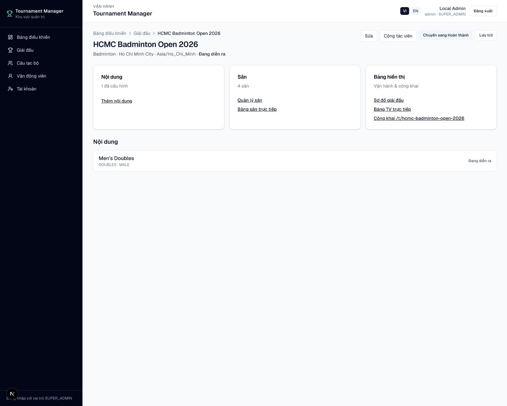

# Hướng dẫn sử dụng Tournament Manager

Tournament Manager hỗ trợ toàn bộ quy trình vận hành giải đấu: phân loại theo
môn thể thao, chuẩn bị dữ liệu, áp dụng preset luật, bốc thăm, xếp lịch theo
giai đoạn, ghi tỉ số theo sân, in lịch và công khai kết quả.

Tài liệu này dành cho:

- **Quản trị hệ thống** (`SUPER_ADMIN`): quản lý tài khoản và quyền truy cập
  nền tảng.
- **Ban tổ chức** (`ADMIN` / `OPERATOR`): thiết lập và điều hành giải.
- **Trọng tài theo sân**: mở link sân và nhập PIN, không cần tài khoản.
- **Khán giả**: xem lịch, kết quả, bảng xếp hạng và bảng live.

Giao diện hỗ trợ **Tiếng Việt** và **English**. Có thể đổi ngôn ngữ trên
header Admin, cuối khung đăng nhập hoặc trang giải công khai.

<figure markdown="span">
  
  <figcaption>IMG-01 · Trang đăng nhập và lựa chọn ngôn ngữ · Desktop.</figcaption>
</figure>

## Khái niệm nhanh

| Vai trò | Cách vào hệ thống | Việc chính |
|---|---|---|
| **Super Admin** | `/login` → `/admin/users` | Tạo, phân quyền, khóa tài khoản và đặt lại mật khẩu |
| **Admin / Operator** | `/login` → `/admin` | Vận hành các giải được sở hữu hoặc phân quyền |
| **Trọng tài theo sân** | `/r/{slug}/c/{mã-sân}` + PIN | Ghi tỉ số trên đúng sân được phân công |
| **Khán giả** | `/t/{slug}` hoặc `/t/{slug}/live` | Theo dõi giải ở chế độ chỉ đọc |

<figure markdown="span">
  
  <figcaption>IMG-02 · Dashboard chỉ hiển thị các giải người dùng được phép truy cập · Desktop.</figcaption>
</figure>

<figure markdown="span">
  
  <figcaption>IMG-03 · Tổng quan giải, nội dung, sân và bảng hiển thị · Desktop.</figcaption>
</figure>

## Luồng vận hành

1. Super Admin [tạo tài khoản và phân quyền](quan-ly-tai-khoan.md).
2. [Chuẩn bị giải](chuan-bi-giai.md): tạo nội dung, luật, vòng đấu và danh sách đăng ký.
3. [Import dữ liệu](import-export.md) hoặc nhập thủ công.
4. [Bốc thăm](boc-tham.md), sinh trận và [xếp lịch](xep-lich.md) theo từng
   giai đoạn.
5. [Thiết lập sân và PIN](san-va-pin.md).
6. [Điều hành ngày thi đấu](ngay-thi-dau.md).
7. Chia sẻ [trang công khai](khan-gia.md) cho khán giả.

!!! tip "Bắt đầu nhanh"
    Nếu chỉ cần chạy thử, xem [Môi trường demo](demo.md) để khởi động hệ thống và dùng dữ liệu mẫu.
