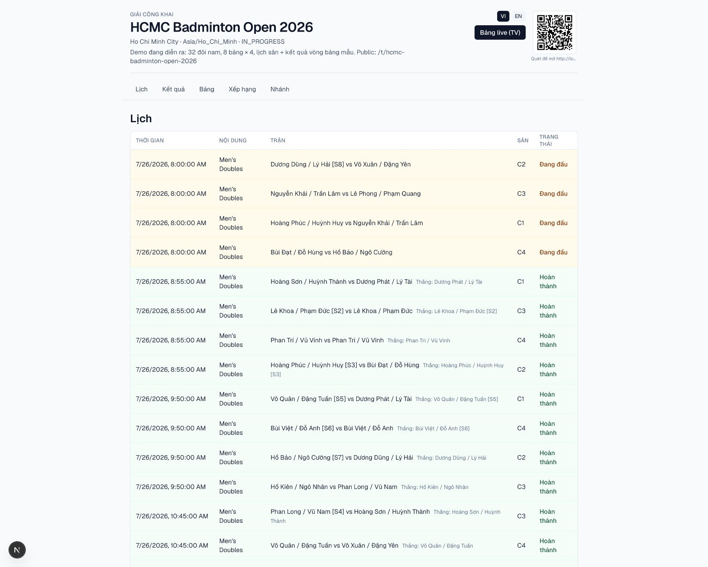
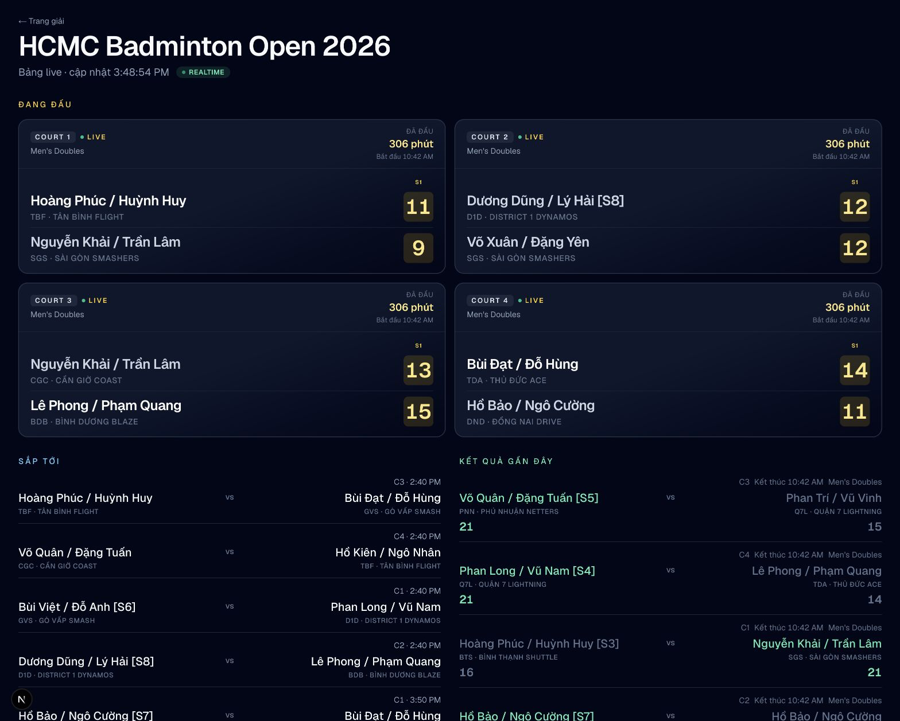

# Trang công khai cho khán giả

Trang giải công khai không yêu cầu đăng nhập:

```text
{APP_URL}/t/{tournament-slug}
```

Nội dung gồm lịch, kết quả, bảng đấu, xếp hạng, sơ đồ loại trực tiếp và QR.
Dữ liệu công khai không chứa số điện thoại, email hoặc thông tin cá nhân nhạy
cảm.

<figure markdown="span">
  
  <figcaption>IMG-23 · Trang giải công khai với lịch, kết quả và nội dung thi đấu.</figcaption>
</figure>

## Bảng trực tiếp

```text
{APP_URL}/t/{tournament-slug}/live
```

Phù hợp để mở trên TV hoặc chia sẻ cho khán giả theo dõi trận đang diễn ra và đếm ngược gọi vào sân.

<figure markdown="span">
  
  <figcaption>IMG-24 · Bảng trực tiếp dành cho TV hoặc màn hình lớn.</figcaption>
</figure>

Trang công khai tự cập nhật định kỳ. Nếu dữ liệu chưa thay đổi, kiểm tra kết
nối mạng và tải lại trang; không cần đăng nhập khu vực quản trị.
