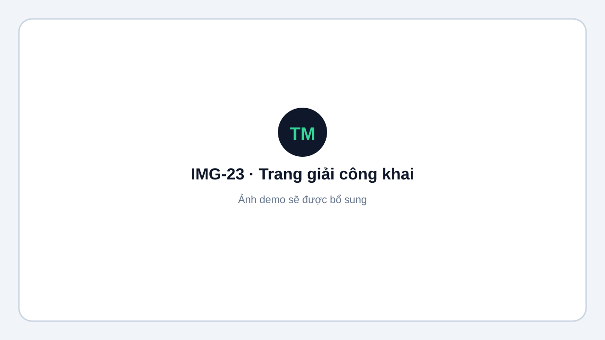
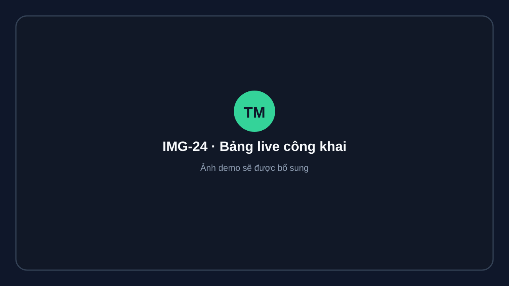

# Trang công khai cho khán giả

Trang giải công khai không yêu cầu đăng nhập:

```text
{APP_URL}/t/{tournament-slug}
```

Nội dung gồm lịch, kết quả, bảng đấu, xếp hạng, bracket và QR. Dữ liệu công khai không chứa số điện thoại, email hoặc PII nhạy cảm.

<figure markdown="span">
  
  <figcaption>IMG-23 · Trang giải công khai với lịch và kết quả · Desktop · Ảnh demo sẽ được bổ sung.</figcaption>
</figure>

## Bảng trực tiếp

```text
{APP_URL}/t/{tournament-slug}/live
```

Phù hợp để mở trên TV hoặc chia sẻ cho khán giả theo dõi trận đang diễn ra và đếm ngược gọi vào sân.

<figure markdown="span">
  
  <figcaption>IMG-24 · Bảng live công khai · TV/Desktop widescreen · Ảnh demo sẽ được bổ sung.</figcaption>
</figure>
