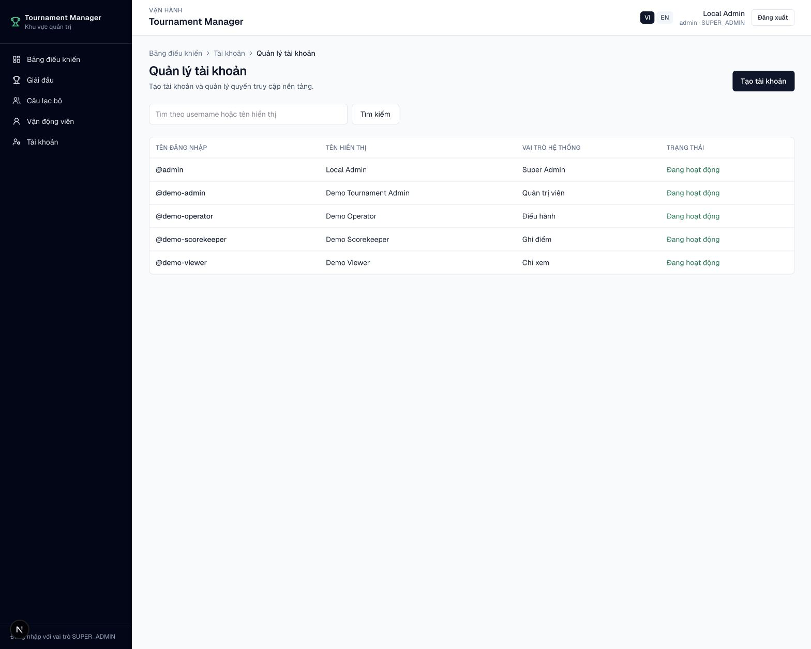
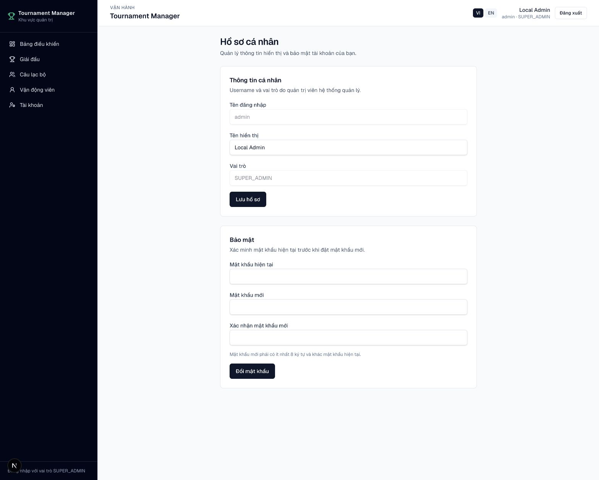

# Quản lý tài khoản

Chức năng này chỉ hiển thị với tài khoản có vai trò hệ thống
`SUPER_ADMIN`.

## Mở trang quản lý

1. Đăng nhập bằng tài khoản `SUPER_ADMIN`.
2. Trên menu bên trái, chọn **Tài khoản**.
3. Danh sách hiển thị username, tên hiển thị, vai trò và trạng thái của
   từng tài khoản.
4. Có thể tìm kiếm theo username hoặc tên hiển thị.

Đường dẫn trực tiếp: `/admin/users`.

<figure markdown="span">
  
  <figcaption>IMG-26 · Super Admin quản lý tài khoản, vai trò và trạng thái đăng nhập.</figcaption>
</figure>

## Tạo tài khoản

1. Trong trang **Tài khoản**, chọn **Tạo tài khoản**.
2. Nhập các thông tin:
   - **Tên đăng nhập:** tối thiểu 3 ký tự; chỉ dùng chữ thường, số, dấu
     chấm, gạch ngang hoặc gạch dưới.
   - **Tên hiển thị:** tên xuất hiện trong khu vực quản trị.
   - **Mật khẩu:** tối thiểu 8 ký tự.
   - **Vai trò hệ thống:** chọn quyền phù hợp với người dùng.
   - **Cho phép tài khoản đăng nhập:** bỏ chọn nếu muốn tạo trước nhưng chưa
     cho phép sử dụng.
3. Chọn **Tạo tài khoản**.

Username không được trùng với tài khoản đã tồn tại.

## Vai trò hệ thống

| Vai trò | Mục đích |
|---|---|
| `SUPER_ADMIN` | Quản lý tài khoản và có toàn bộ thao tác trên dữ liệu được phép truy cập |
| `ADMIN` | Quản trị giải do mình sở hữu hoặc giải được chia sẻ với quyền Admin |
| `OPERATOR` | Điều hành, import, bốc thăm, xếp lịch và ghi điểm theo quyền của giải |
| `SCOREKEEPER` | Vận hành trận đấu và ghi điểm |
| `VIEWER` | Chỉ xem dữ liệu của giải được chia sẻ |

!!! note "Quyền hệ thống và quyền trong giải"
    `SUPER_ADMIN` là quyền cấp nền tảng. Các vai trò `ADMIN`, `OPERATOR`,
    `SCOREKEEPER` và `VIEWER` có thể được gán riêng cho từng giải tại trang
    **Giải đấu → Cộng tác viên**.

## Chỉnh sửa hoặc khóa tài khoản

1. Chọn username trong danh sách tài khoản.
2. Thay đổi tên đăng nhập, tên hiển thị hoặc vai trò.
3. Bật hoặc tắt **Cho phép tài khoản đăng nhập**.
4. Chọn **Lưu thay đổi**.

Khi tài khoản bị vô hiệu hóa, phiên đăng nhập của tài khoản đó không còn được
chấp nhận ở lần kiểm tra tiếp theo. Dữ liệu mà tài khoản sở hữu không bị xóa.

Hệ thống không cho phép:

- Super Admin tự vô hiệu hóa tài khoản của chính mình.
- Super Admin tự hạ quyền tài khoản của chính mình.
- Vô hiệu hóa hoặc hạ quyền Super Admin cuối cùng đang hoạt động.

## Đặt lại mật khẩu

1. Mở tài khoản cần xử lý.
2. Trong phần **Đặt lại mật khẩu**, nhập mật khẩu mới có ít nhất 8 ký tự.
3. Chọn **Đặt lại mật khẩu**.
4. Gửi mật khẩu mới cho người dùng qua kênh an toàn và yêu cầu họ đổi lại
   tại trang **Hồ sơ cá nhân**.

Mật khẩu cũ hết hiệu lực ngay sau khi thao tác hoàn tất.

## Hồ sơ cá nhân

Mọi tài khoản đã đăng nhập đều có thể mở `/profile` từ tên tài khoản ở góc
phải màn hình. Tại đây người dùng có thể:

- Xem username, vai trò hệ thống và trạng thái tài khoản.
- Đổi tên hiển thị.
- Đổi mật khẩu bằng cách nhập mật khẩu hiện tại và mật khẩu mới.

<figure markdown="span">
  
  <figcaption>IMG-27 · Hồ sơ cá nhân tại đường dẫn `/profile`.</figcaption>
</figure>

## Dữ liệu sở hữu và quyền truy cập

- Mỗi câu lạc bộ, vận động viên và giải đấu có chủ sở hữu dữ liệu.
- `ADMIN` chỉ thấy dữ liệu do mình sở hữu hoặc giải được chia sẻ.
- `OPERATOR`, `SCOREKEEPER` và `VIEWER` chỉ thấy giải được gán vai trò cộng
  tác viên tương ứng.
- Giải không được cấp quyền sẽ không xuất hiện trên bảng điều khiển, menu
  hoặc danh sách giải.
- `SUPER_ADMIN` có thể hỗ trợ toàn hệ thống nhưng không làm thay đổi chủ sở
  hữu của dữ liệu.

!!! warning "An toàn tài khoản"
    Không dùng chung tài khoản `SUPER_ADMIN`. Chỉ cấp quyền này cho người
    chịu trách nhiệm quản trị hệ thống và duy trì ít nhất hai Super Admin
    hoạt động để có phương án khôi phục.

## Tài khoản Super Admin đầu tiên

Sau khi chạy migration và seed:

- Tài khoản seed `admin` được gán vai trò `SUPER_ADMIN`.
- Seed tạo thêm `demo-admin`, `demo-operator`, `demo-scorekeeper` và
  `demo-viewer` với mật khẩu mặc định `demo1234`.
- Khi nâng cấp hệ thống cũ chưa có Super Admin, migration ưu tiên tài khoản
  seed hoặc một tài khoản `ADMIN` đang hoạt động.
- Nên đổi ngay mật khẩu mặc định trước khi đưa hệ thống lên production.
