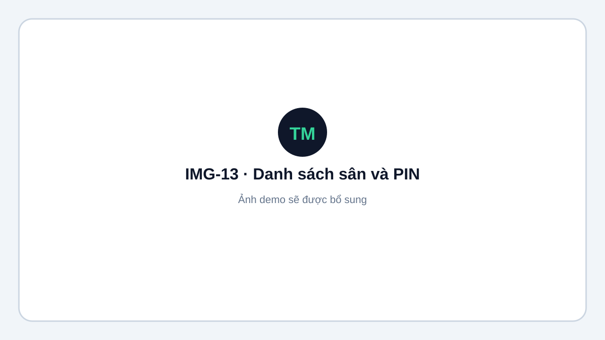
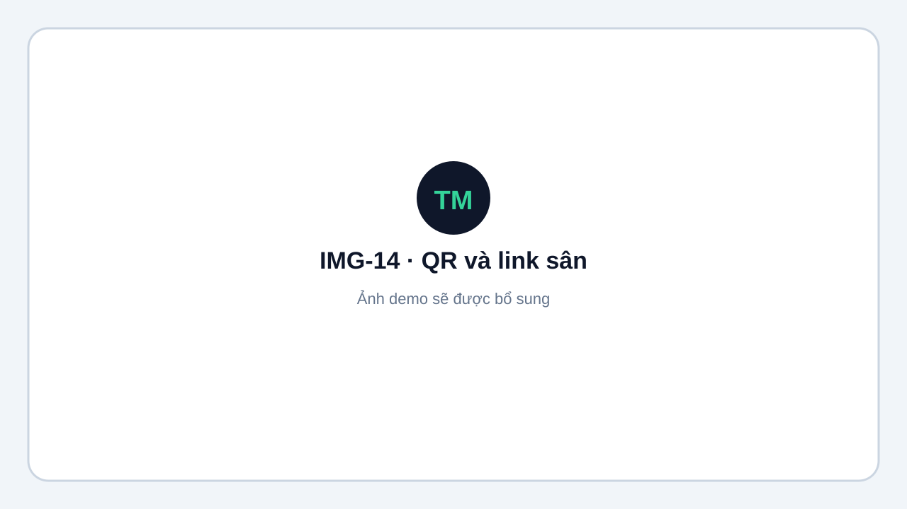

# Sân và PIN trọng tài

Vào **Admin → Giải → Sân (Courts)**.

## Thiết lập sân

1. Thêm sân với tên và mã, ví dụ `C1`.
2. Đặt PIN từ **4–6 chữ số**.
3. Sao chép link công khai:

```text
{APP_URL}/r/{slug-giải}/c/{mã-sân}
```

Ví dụ demo:

- Link: `/r/hcmc-badminton-open-2026/c/C1`
- PIN: `1234`

<figure markdown="span">
  
  <figcaption>IMG-13 · Danh sách sân, trạng thái và thiết lập PIN · Desktop · Ảnh demo sẽ được bổ sung.</figcaption>
</figure>

<figure markdown="span">
  
  <figcaption>IMG-14 · Sao chép link và QR dành cho trọng tài sân · Desktop · Ảnh demo sẽ được bổ sung.</figcaption>
</figure>

## Lưu ý

- Chưa đặt PIN: link sân trả 404 và không mở được màn ghi điểm.
- Xóa PIN: khóa truy cập bằng link sân.
- Có thể đổi PIN bất cứ lúc nào.
- Có thể in QR trực tiếp từ trang Courts.
- Chỉ chia sẻ link và PIN cho trọng tài phụ trách sân tương ứng.
