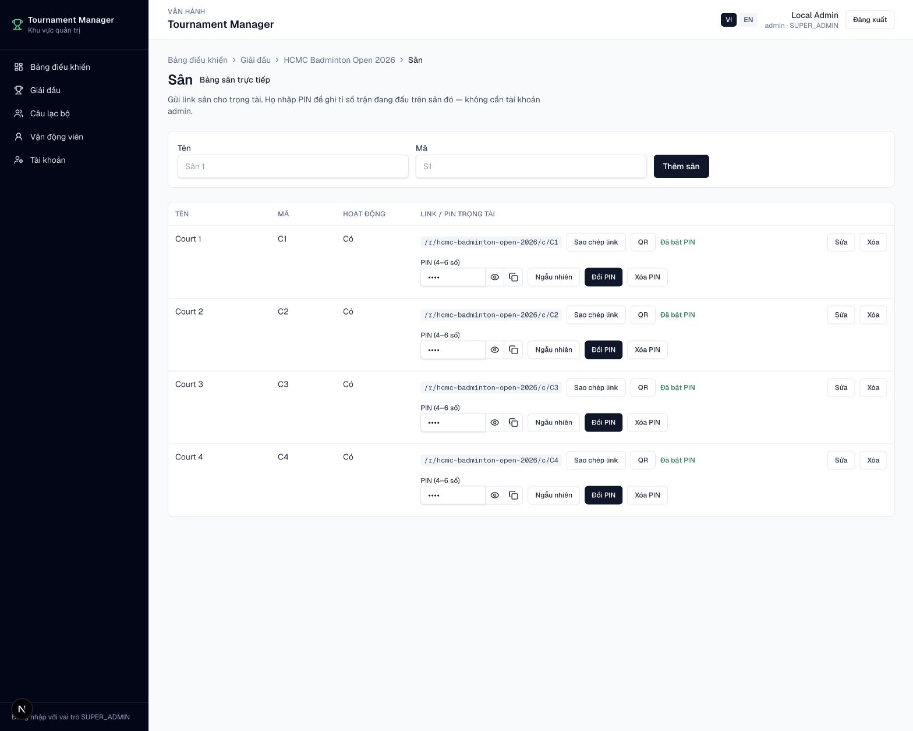
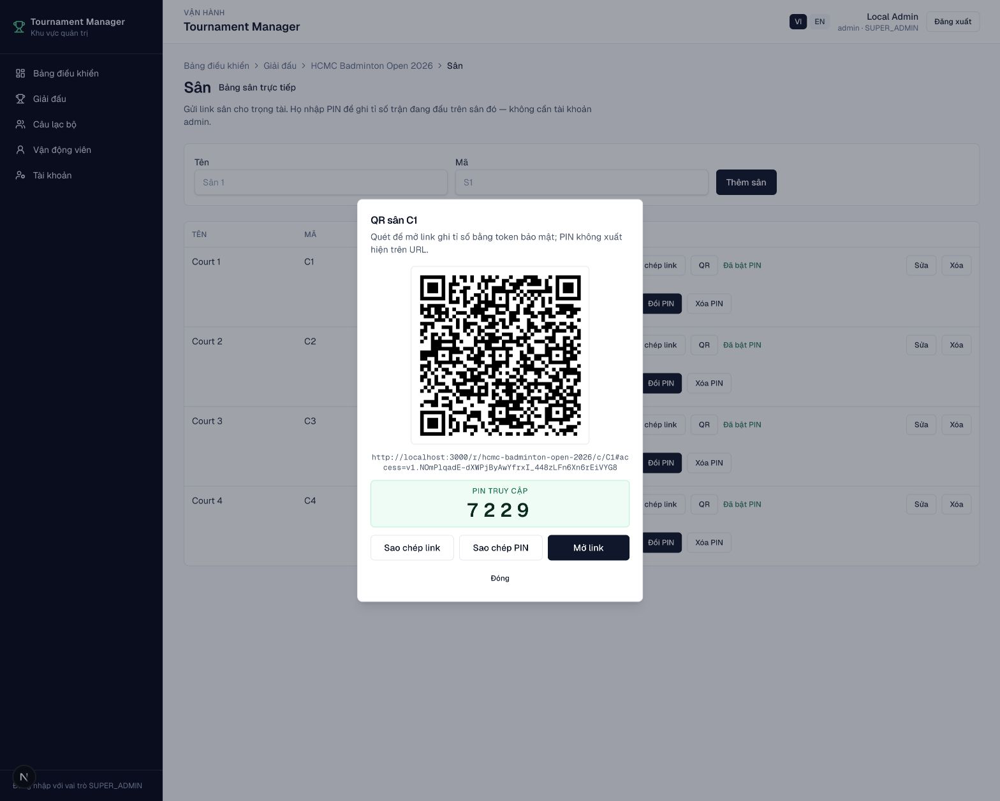

# Sân và PIN trọng tài

Vào **Admin → Giải → Sân (Courts)**.

## Thiết lập sân

1. Thêm sân với tên và mã, ví dụ `C1`.
2. Chọn **Sửa** để đổi tên, mã hoặc trạng thái hoạt động.
3. Đặt PIN từ **4–6 chữ số**.
4. Dùng biểu tượng con mắt để xem/ẩn PIN và nút sao chép để gửi riêng cho
   trọng tài.
5. Sao chép link hoặc mở QR:

```text
{APP_URL}/r/{slug-giải}/c/{mã-sân}
```

Link/QR có fragment token bảo mật `#access=...`. PIN không xuất hiện trực tiếp
trên URL và token cũ hết hiệu lực khi đổi hoặc xóa PIN.

<figure markdown="span">
  
  <figcaption>IMG-13 · Danh sách sân, chỉnh sửa trạng thái và nhóm điều khiển PIN · Desktop.</figcaption>
</figure>

<figure markdown="span">
  
  <figcaption>IMG-14 · QR bảo mật, link sân và PIN dành cho trọng tài · Desktop.</figcaption>
</figure>

## Lưu ý

- Chưa đặt PIN: chức năng sao chép link và QR bị khóa.
- Xóa PIN: khóa truy cập bằng link sân.
- Có thể đổi PIN bất cứ lúc nào; link/QR cũ lập tức mất hiệu lực.
- Có thể in QR trực tiếp từ trang Courts.
- Chỉ chia sẻ link và PIN cho trọng tài phụ trách sân tương ứng.
- `OPERATOR` có thể vận hành PIN nhưng chỉ vai trò có quyền setup mới được
  thêm, sửa hoặc xóa sân.
