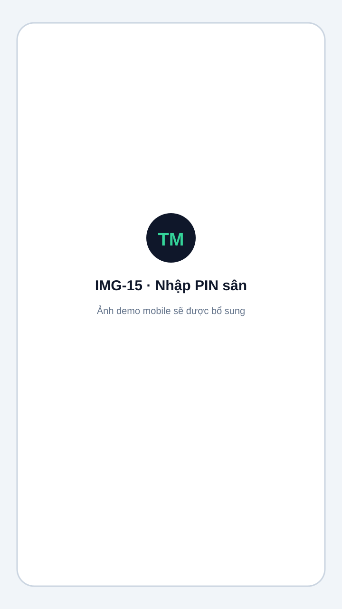
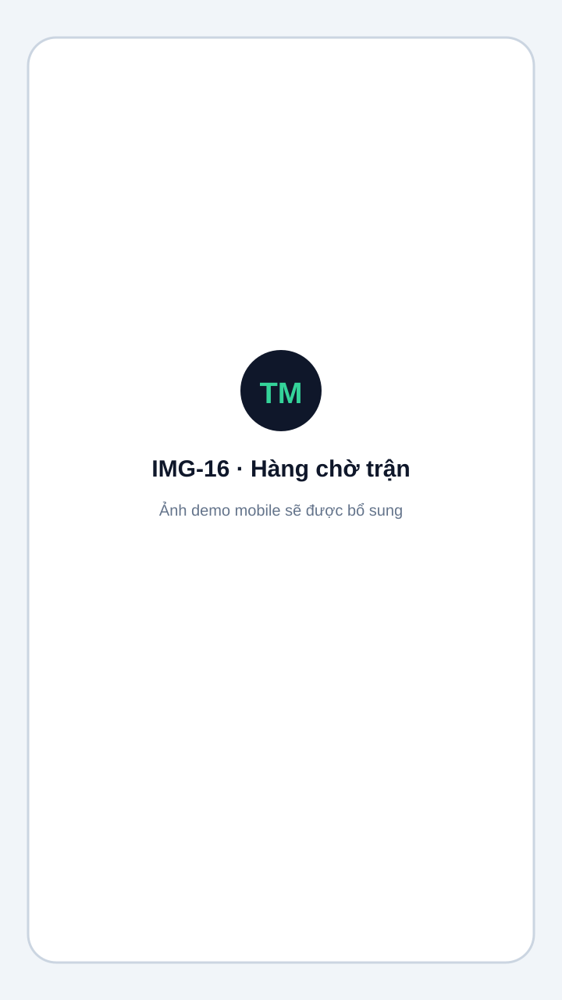
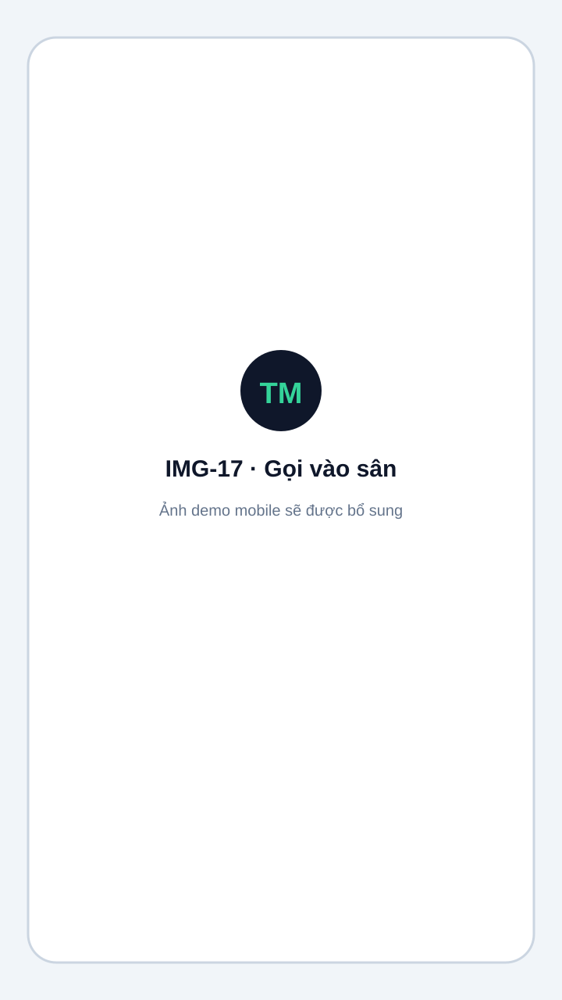
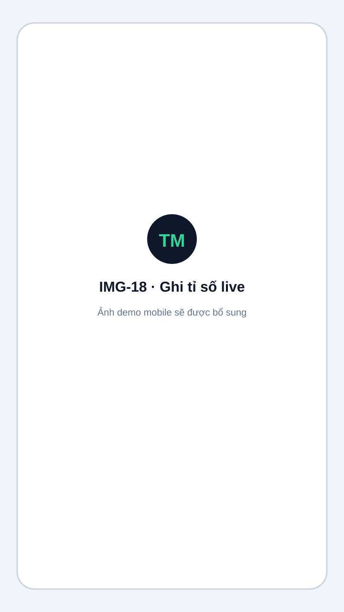
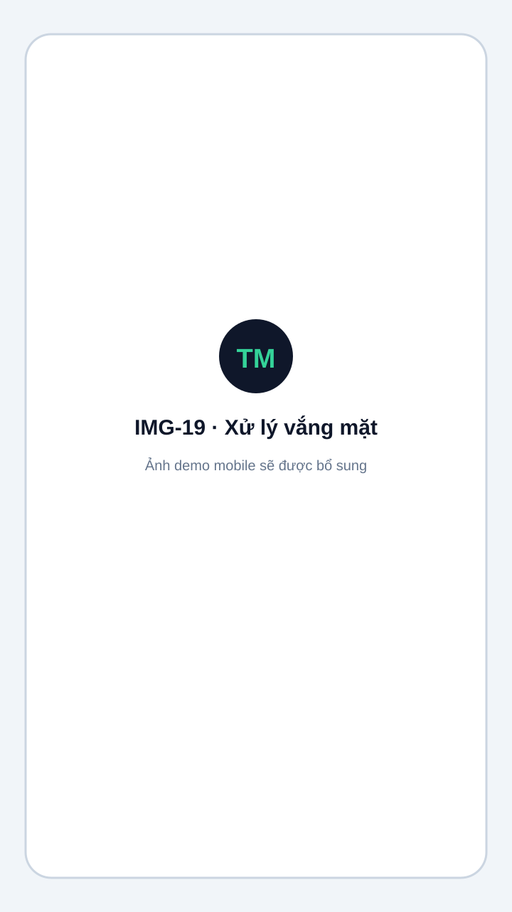

# Trọng tài ghi tỉ số theo sân

Trọng tài dùng điện thoại hoặc tablet, không cần tài khoản Admin.

## Mở khóa

1. Mở link `/r/{slug}/c/{mã-sân}`.
2. Nhập PIN.
3. Chọn **Mở khóa**.

Phiên được lưu bằng cookie trong khoảng 12 giờ. Chọn **Khóa** khi trả thiết bị hoặc hết ca.

<figure markdown="span">
  
  <figcaption>IMG-15 · Nhập PIN để mở khóa sân · Mobile · Ảnh demo sẽ được bổ sung.</figcaption>
</figure>

## Khi sân chưa có trận

- Trận đã gán sân sẽ có nút **Bắt đầu trận**.
- Trận chưa gán sân xuất hiện trong hàng chờ; chọn cặp đấu rồi **Bắt đầu ngay**.

<figure markdown="span">
  
  <figcaption>IMG-16 · Sân trống, trận đã gán và hàng chờ · Mobile · Ảnh demo sẽ được bổ sung.</figcaption>
</figure>

## Gọi vào sân

1. Chọn thời gian đếm ngược 1, 3 hoặc 5 phút.
2. Bảng live hiển thị **Vào sân sau…**.
3. Hết giờ, trạng thái đổi thành **Vào sân!**
4. Chọn **Hủy gọi** nếu cần đổi hoặc hủy cặp đấu.

<figure markdown="span">
  
  <figcaption>IMG-17 · Gọi vào sân và đếm ngược warmup · Mobile · Ảnh demo sẽ được bổ sung.</figcaption>
</figure>

## Ghi tỉ số

- Màn hình hiển thị cặp đấu và bảng nhập điểm.
- Tự lưu điểm live mặc định được bật.
- Có thể đổi bên A/B trước khi gọi vào sân.
- Khi đủ số set thắng, nộp kết quả để kết thúc trận.

<figure markdown="span">
  
  <figcaption>IMG-18 · Ghi tỉ số live cho trận đang đấu · Mobile · Ảnh demo sẽ được bổ sung.</figcaption>
</figure>

## Xử lý vắng mặt

1. Chọn **Vắng mặt**.
2. Chọn đội không có mặt.
3. Xác nhận để đội còn lại thắng walkover.

<figure markdown="span">
  
  <figcaption>IMG-19 · Xác nhận đội vắng mặt · Mobile · Ảnh demo sẽ được bổ sung.</figcaption>
</figure>

## Giới hạn quyền

Trọng tài PIN chỉ được thao tác trên đúng sân:

- Gọi vào sân hoặc bắt đầu trận.
- Chọn trận từ hàng chờ.
- Lưu live và kết thúc trận.
- Đổi bên trước khi gọi vào sân.
- Xử lý vắng mặt.

Trọng tài PIN không thể hủy trận, sửa điểm sau khi hoàn thành hoặc dùng các thao tác đặc biệt khác. Audit ghi metadata `{ via: "court_pin", courtId }`, không gắn user Admin.
