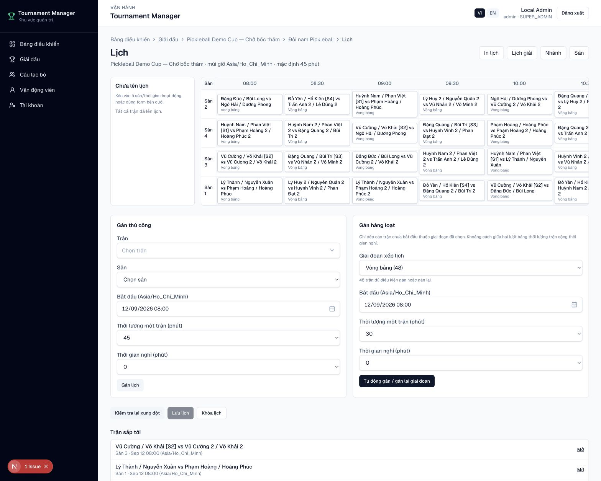
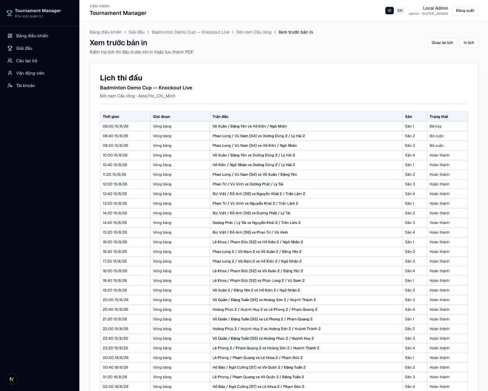

# Xếp lịch thi đấu

Vào **Giải đấu → Nội dung → Lịch** sau khi đã sinh trận.

## Hai giai đoạn xếp lịch

Với thể thức vòng bảng kết hợp loại trực tiếp, lịch được gán theo hai giai
đoạn độc lập:

1. Chọn giai đoạn **Vòng bảng**, cấu hình thời gian rồi tự động gán.
2. Khi bracket đã có đủ cặp, chọn giai đoạn **Loại trực tiếp** và gán tiếp.

Chỉ các trận chưa bắt đầu, chưa có kết quả và đã xác định đủ hai bên mới được
gán hoặc gán lại.

## Gán hàng loạt

1. Chọn **Giai đoạn xếp lịch**.
2. Chọn thời điểm bắt đầu theo múi giờ của giải.
3. Chọn **Thời lượng một trận**: 30, 45 hoặc 60 phút.
4. Chọn **Thời gian nghỉ**.
5. Chọn **Tự động gán / gán lại giai đoạn**.
6. Kiểm tra xung đột rồi chọn **Lưu lịch**.

Khoảng cách giữa hai lượt bằng **thời lượng trận + thời gian nghỉ**. Engine
tránh trùng sân, trùng VĐV và cố gắng không xếp cùng một cặp thi đấu ở hai lượt
liên tiếp.

<figure markdown="span">
  
  <figcaption>IMG-28 · Lưới sân/thời gian, gán thủ công và gán hàng loạt theo giai đoạn · Desktop.</figcaption>
</figure>

## Gán thủ công và gán lại

- Kéo trận vào ô sân/thời gian hoặc dùng form **Gán thủ công**.
- Có thể chạy tự động gán lại nhiều lần để thử phương án khác.
- Trận đã bắt đầu, đã hoàn tất hoặc chưa xác định đủ hai bên không bị thay đổi.
- Sau khi chọn **Khóa lịch**, mọi thao tác gán và tự động gán lại bị chặn.

!!! warning "Knockout"
    Không xếp trước các trận knockout còn hiển thị **Chưa xác định vs Chưa xác
    định**. Hãy cập nhật kết quả vòng trước để xác định cặp đấu rồi gán lịch
    cho giai đoạn knockout.

## Xem trước và in

Chọn **In lịch** để mở trang xem trước riêng. Trang này chỉ liệt kê các trận
đã có thời gian, sắp xếp theo thời gian và hiển thị giai đoạn, cặp đấu, sân,
trạng thái.

<figure markdown="span">
  
  <figcaption>IMG-25 · Trang xem trước trước khi in hoặc lưu PDF · Desktop.</figcaption>
</figure>

Tại trang xem trước:

- Chọn **In lịch** để mở hộp thoại in.
- Chọn **Quay lại lịch** để chỉnh sửa.
- Sidebar, header quản trị và nút thao tác tự ẩn trên bản in.
